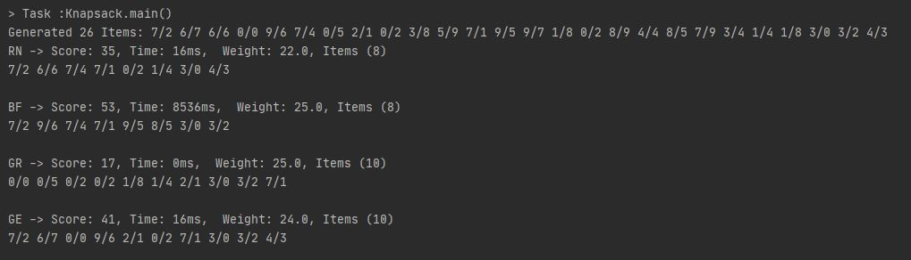

# Solving the Knapsack problem in Java

This projects showcases a possible attempt to solve the knapsack problem in Java.

There are three strategies included:

1. A brute force strategy trying out all possible solutions (see `BruteForceStrategy.java`).
2. A greedy strategy which selects all the highest value items until the weight limit is reached (`GreedyStrategy.java`).
3. A genetic strategy which uses a evolutionary approach to select the best combination of items (`GeneticStrategy.java` and `GenericGeneticSolvingStrategy.java`).

## Limitations

- Brute Force Strategy gets slow fast (>28).
- GeneticStrategy is limited to max. 16 items.

## Usage
Call `Knapsack.main()`. Simply adjust the parameters in `Knapsack.java`.

